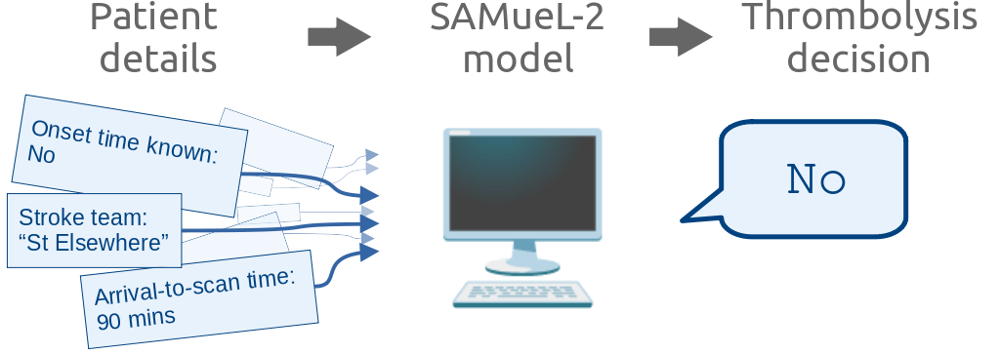
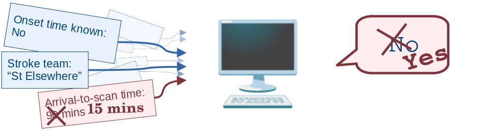
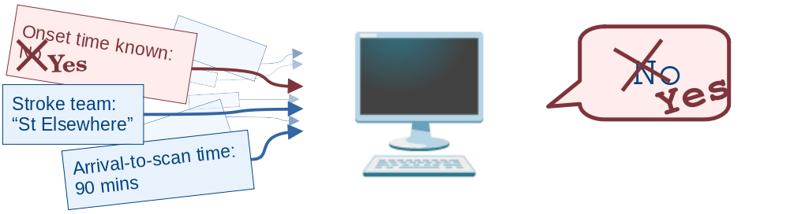

# Thrombolysis decisions 

This repository contains the code behind the Streamlit app for the SAMueL-2 machine learning model for predicting thrombolysis use with "what if?" changed scenarios. Its main demo page is included in the combined stroke app:

The model is described in the [online SAMuEL book](https://samuel-book.github.io/samuel-2/samuel_shap_paper_1/introduction/intro.html). In particular, [this page](https://samuel-book.github.io/samuel-1/pathway_sim/scenario_analysis.html) describes the three different scenarios:

  + faster speed to treatment
  + more onset times known
  + match benchmark hospitals.

The app takes user inputs to select which scenario(s) to change, and the outputs are the changed thrombolysis rate and number of additional good outcomes for each team with the changed scenario(s).

## Layout of the code

The `.py` file behind each page is kept as short as possible so that it is easier to change the layout of the displayed page.

This app does not actually calculate the changed rates with scenarios, but instead looks up values from an existing table. Most of the formatting and displaying of objects is in the "container" scripts e.g. `utilities_ml/container_X.py` (named for [Streamlit's way of grouping objects](https://docs.streamlit.io/library/api-reference/layout/st.container) but actually just `.py` scripts with all of the code needed to populate that chunk of the page).

### Which scripts do you need?

If you want to use the data but aren't interested in the Streamlit parts, you will need the following file:

+ `data_pathway/scenario_results.csv` - The main table of results. It contains the following data:
  + Baseline good outcomes per 1000 patients: median, low 5%, high 95%, mean, standard deviation, 95% confidence interval.
  +	Percent thrombolysis: median, low 5%, high 95%, mean, standard deviation, 95% confidence interval.
  +	Additional good outcomes per 1000 patients: median, low 5%, high 95%, mean, standard deviation, 95% confidence interval.	  
  + Onset to needle (mean) - time in minutes,
  + Calibration - a fixed value here, so ignore this column.
  + Scenario 
  + Stroke team - anonymised hospital ID.

The other file in the data directory, `data_pathway/hospital_10k_thrombolysis.csv`, contains the thrombolysis rate for each hospital when given the 10k cohort. The teams with the top 30 highest thrombolysis rates are labelled as benchmark teams in the app.

### Pages 

The Streamlit landing page is `1: Introduction.py`. In the sidebar there are a series of other pages to choose, and these are stored in the `pages/` directory:

+ `2: Interactive_demo.py` - the main page. The user can select the scenario and receive the thrombolysis rate at 132 stroke hospitals.
+ `3: Advanced_options.py` - currently empty.
+ `4: Project.py` - information about the project and people behind this project.
+ `5: Cite_this_work.py` - Zenodo citation. 
+ `6: Resources.py` - links to further useful materials. 

The page topics follow the recommendations of Tom Monks and Alison Harper (in Proceedings of the Operational Research Society Simulation Workshop 2023 (SW23)). 

When these pages display a large amount of markdown text in one go, that text is imported from a `.txt` file in `pages/text_for_pages/` to prevent constant re-spacing to keep the lines below 79 characters. 